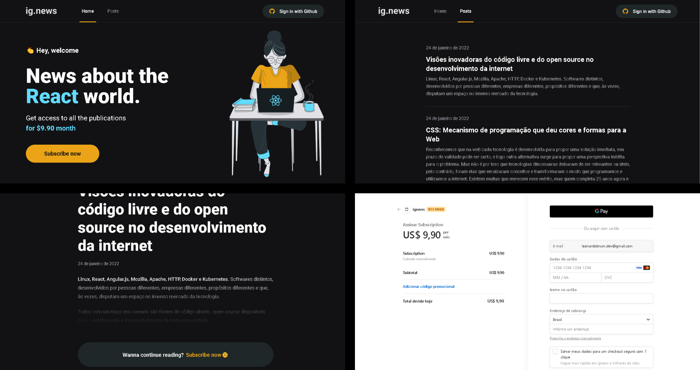

# Ignews

<div>
  
</div>

Essa aplicação é um blog onde o usuário pode assinar um plano de pagamento e ter acesso as postagens.

<div>
  
</div>

# About this Project

  This application is a blog where the user can subscribe to a payment plan and have access to posts.
  
# Functionalities

- User data validation on login screen.
- Get user data from a fake API.
- Lists only 10 users, being able to access the rest through pagination.
- Cache user data.

# Some Observations about this App

- There's no functionality of Login/Register, only data validation.

# Getting Started

### Installing

**Cloning the Repository**

```
$ git clone https://github.com/LeonardoBrum0907/dashgo.git

$ cd dashgo
```

**Installing dependencies**

```
$ yarn
```

_or_

```
$ npm install
```

# Built With

- [NextJS](https://nextjs.org/docs) - Build app using ReactJS, NextJS and Typescript.
- [React-Query](https://react-query-v2.tanstack.com/overview) - React State Manager.
- [React-Hook-Form](https://react-hook-form.com/get-started) - Form validation.
- [Apexcharts](https://apexcharts.com/docs/react-charts/) - Create charts.
- [React-Icons](https://react-icons.github.io/react-icons/) - Icons 👨‍💻
- [Axios](https://axios-http.com/docs/intro) - HTTP Client.
- [MirageJS](https://miragejs.com/docs/getting-started/introduction/) - Fake API.
- [FakerJS](https://fakerjs.dev/guide/) - Create random data.
- [Chakra-UI](https://chakra-ui.com/getting-started/nextjs-guide) - Styles.
